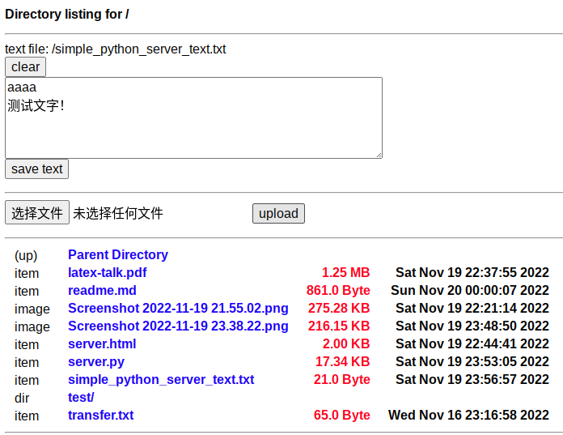

# Simple HTTP Server

基于 [UniIsland 的 Gist](https://gist.github.com/UniIsland/3346170) 和 [Tallguy297/SimpleHTTPServerWithUpload](https://github.com/Tallguy297/SimpleHTTPServerWithUpload) 的代码，稍作修改：
1. 移除了图标
2. 解决了 Ctrl-C 退出后立刻重启，提示 `port already in use` 的问题
3. 增加文本保存功能

效果见 [example.html](example.html)

---

Based on code of [UniIsland's Gist](https://gist.github.com/UniIsland/3346170) and [Tallguy297/SimpleHTTPServerWithUpload](https://github.com/Tallguy297/SimpleHTTPServerWithUpload), with slight modification for my own use case:
1. Removes the icons
2. Fix the bug that if the script is stopped using Ctrl-C and immediately restarted, it will fail with `port already in use`
3. Add the ability to quickly save text to a text file

See [example.html](example.html)